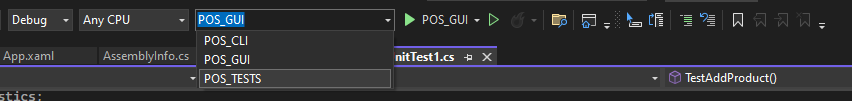
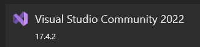
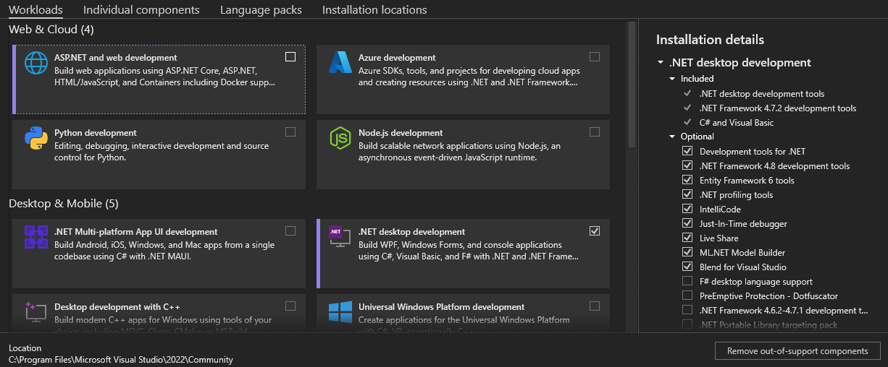

# Development enviroment 

## IDE
[Visual Studio](https://learn.microsoft.com/en-us/visualstudio/windows/?view=vs-2022)

## Frameworks
[.Net 6.0](https://learn.microsoft.com/en-us/dotnet/fundamentals/) \
[WPF](https://learn.microsoft.com/en-us/visualstudio/get-started/csharp/tutorial-wpf?view=vs-2022)

## Languages 
XAML, for WPF \
C#

## Tests
The tests are using the MSTest framework.

## Coding Convention
[Microsoft C# Coding Conventions](https://learn.microsoft.com/en-us/dotnet/csharp/fundamentals/coding-style/coding-conventions)

## To run GUI, CLI or tests

To run the test, press 'Test' then 'Run All Tests' (Ctrl+R, A)
\

\
\
Note: The first time you run the newly cloned project and you get an error message, read under [Database](#Database) how to fix (next title)

## Database
For the error message:\
Copy the database (db file) from `assets` to `documents/restaurant-database` \
The `restaurant-database` folder should have been created if you ran the the project

## VS

Workloads: \

# Definition of Done
-Unless everyone present has worked together, the remaining people must check the task before it can be considered done.

-Code must pass all relevant tests and code validation.

-Code must follow the coding standard.

-All documents and spreadsheets must be uploaded to Google Drive and all code must be uploaded to GitHub.  

-Task must be submitted to the presentation document if it is present in the backlog.

-Comment tricky code.

-Branches shall be merged.

## Not implemented
- Add a `remove product` feature to remove individual products from cart
- The `pay`, `clear`, and `totalprice` need to be resized in the GUI
- General fix the GUI design
- Automatically create/copy the database
- A way to book tables